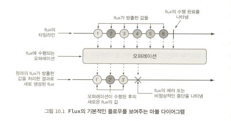

# java-reactor-example
Reactive Stream의 대표 구현체인 reacor를 공부하며 예제를 정리한 레포지토리입니다.

# Marble Diagram
리액티프 스트림즈를 이해하려면 마블 다이어그램에 대한 개념을 먼저 알아야합니다.

리액티브 플로우는 마블 다이어그램 ( `marble diagram` ) 으로 나타냅니다. 
 

마블 다이어그램의 제일 위에는 `Flux`나 `Mono`를 통해 전달되는 데이터의 타임라인을 나타내고, 중앙에는 오퍼레이션, 제일 밑에는 결과로 생성되는 `Flux`나 `Mono`의 타임라인을 나타냅니다.

특정 메서드에 대한 마블 다이어그램을 보고싶다면 메서드에 마우스를 갖다 대세요.

# 공부순서
테스트코드에 주석으로 개념을 설명합니다. 다음 순서에 따라 테스트코드를 따라가며 공부합니다.

* `reactiveStreams` 디렉토리
* `reactor` 디렉토리

# 참고자료
* `스프링 인 액션`
